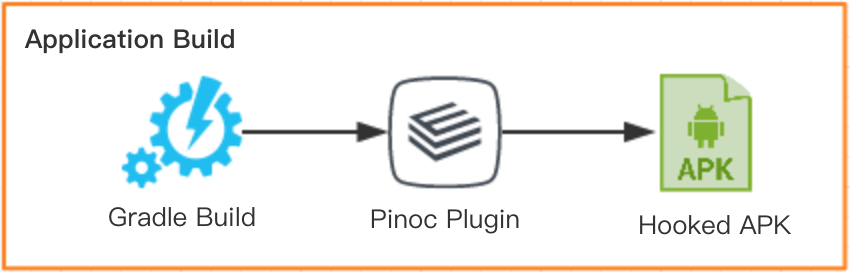
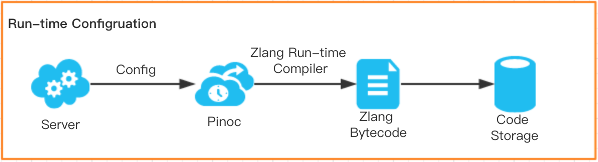
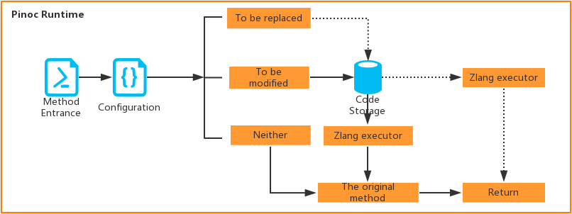

# Pinoc

Pinoc is a novel library for dynamic classloader-free modification of an Android app.

Specifically, Pinoc supports the code injection at the entrance to a Java method, the code replacement of a whole Java method,
and the addition of a new Java method.

[Chinese translation 中文翻译版](docs/README_CHINESE.md)

## Features

1. Provides a novel technique for hotfix deployment without the need of a Java classloader.

2. Provides a novel technique for dynamic event tracking.

3. High compatibility. Pinoc can run at all JVM-based platforms.

4. Real-time effect. Pinoc will replace or modify the methods immediately
once it has read the specified configuration.

## Principle

When an Android app is built, the Pinoc plugin replaces each Java method in your app with
its variant. Specifically, after the replacement of each method (the original method) is replaced with its variant.


<br/>


At runtime, when a method is invoked, it is the variant of the original method that is actually invoked.
The variant is responsible for invoking its original method.
Before that, however, it first passes the information about the invocation to Pinoc,
which decides whether to replace or modify the original method,
according to a configuration file, which may be downloaded from a server.



To avoid the trouble caused by the Java classloader, Pinoc does not adopt the Java classloader
to load and execute the replacement or modification of the original method.
Thus the replacement or modification of the original method is not written in Java,
but in [Zlang](https://github.com/Xiaofei-it/Zlang),
a flexible dynamically-typed programming language running on the
JVM and supporting access to Java objects and interaction with Java at runtime.
It is easy to convert a Java method or statement into a Zlang function or statement.

Therefore, at runtime, if Pinoc decides to replace or modify a particular method,
it compiles the instructions of the replacement or modification
of such method by the Zlang compiler into Zlang bytecode,
after which the Zlang bytecode is passed to the Zlang executor for execution.
As a result, the replacement or modification of such method is executed
and such method is thus replaced or modified.

See [Principle of Pinoc](docs/pinoc_principle.md) for more information.

## High performance

As for the memory and CPU usage, Pinoc has a high performance in memory and CPU usage,
so it will not affect the memory and CPU usage of your app.

As for the time spent executing methods, although Pinoc injects a code snippet
at the entrance of each method, most of the code snippet only retrieve a `ConcurrentHashMap`
and return immediately, and the time overhead is thus extremely low.

We have measured the time spent executing some methods and their Pinoc variants
for comparison.
Specifically, we measured the time spent executing a particular method for 100000 times,
and divided such time by 100000 to obtain the time spent executing such method only once.

Illustrated in the following table is the result:

|  A method | Executing it (nanoseconds) | Pinoc variant (nanoseconds)| Pinoc overhead (nanoseconds)|
| :------: | :------:| :------:| :------:|
|  Empty method | 46.46094| 737.08698 | 690.62604 |
|  Complex method | 36771.06509| 37713.69061 | 942.62552 |
| More complex method |74522.70934 | 75466.49896| 943.78962 |

In the above table, the second column shows the time spent executing the method in the first column,
the third column shows the time spent executing its Pinoc variant,
and the fourth column shows the Pinoc overhead.
All of the data shown in the table are **in nanoseconds**.

From the table, we can see that the time spent executing the injected code snippet
is **less than 1 microsecond**, which is an extremely low time overhead.

## Comparision with other techniques

Since Pinoc can replace and modify Java methods, we may adopt it for hotfix deployment and dynamic event tracking.

### Hotfix deployment

Compared with the other techniques for hotfix deployment, Pinoc has the following advantages:

1. Classloader-free. Pinoc does not adopt a Java classloader to load the hotfix.

2. High compatibility. Pinoc can run at all JVM-based platforms.

3. Real-time effects. Pinoc will replace or modify the methods immediately
once it has read the specified configuration.

### Dynamic event tracking

Compared with all of the bare current techniques, Pinoc has the following advantages:

1. Any method of any class can be tracked.

2. The tracking instructions can be specified dynamically and may perform almost
all the operations allowed by Android.

See [Principle of Pinoc](docs/pinoc_principle.md) for more information.

## Usage and demo

The replacement and modification of a method should be written in Zlang,
which is very easy to learn and use.

To learn Zlang, please refer to [Zlang](https://github.com/Xiaofei-it/Zlang).
We are sure that you will be able to master and use it **in one hour**.

As for Pinoc, we provide you with [Usage of Pinoc](docs/pinoc_usage.md).

After learning Pinoc, you may refer to [Demo of Pinoc](docs/pinoc_demo.md)
to learn a demo.

## Deployment

To use the Pinoc library, add the following in your `build.gradle`:

```
buildscript {
    repositories {
        jcenter()
    }
    dependencies {
        classpath 'com.iqiyi:pinoc-plugin:0.3.0'
    }
}
apply plugin: "pinoc"
```

Also, you may disable Pinoc temporarily by adding the following
in `gradle.properties` of your project or modules:

```
pinoc-plugin.enabled=false // true by default
```

## License

Copyright (C) 2017 iQIYI.com

The binaries and source code of the Pinoc library and the Pinoc plugin can be used according to the
[Apache License, Version 2.0](http://www.apache.org/licenses/LICENSE-2.0.html).