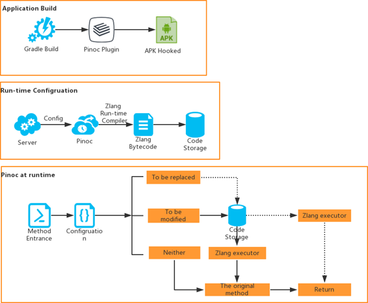

# Pinoc

***注意*** 此版本只是中文翻译版，不一定会实时更新。如有能力，请阅读英文原版。

Pinoc是一种Android新型无需使用类加载器的动态代码修改方案，支持在方法入口处进行代码注入、方法替换、方法新增，还支持对代码进行动态化跟踪。

## 特性

1. 提供一种无需ClassLoader进行类加载，即可进行Java代码部署的热修复方案。

2. 提供一种新型的代码动态跟踪方案。

3. 高可适性，能在任何支持Java虚拟机的环境上运行。

4. 实时高效，根据Zlang解析的配置文件实时修改和替换对应方法。

## 设计原理



APP在构建过程中，Pinoc构建插件根据特定变种算法替换APP中的每个Java方法，编译之后，每个方法（原始方法）都被替换为特定的变种。

APP运行过程中，方法的调用实际上是原始方法的变种方法被调用。通过服务器下载的可配置文件，APP程序依据Zlang解释器将其转换为APP可识别的代码，
并相应的原始方法进行替换或修改。

为避免Java classloader在程序的运行过程中产生异常，并且很难通过安全审核，Pinoc未采用Java的classloader进行热部署和热跟踪，另外所有被替换和修改的方法都使用Zlang语言编写。

Zlang是一种运行在Java虚拟机的动态灵活的编程语言，支持Java对象的调用，在运行时可以与Java环境交互。开发者可以轻易地将Java代码转化为Zlang代码。

App运行过程中，如果Pinoc决定修改或替换某个方法，它将方法的替代品或者修改用Zlang编译器
编译，编译器的输出用来执行。（这部分我不知道怎么翻译，请看原版）

查看Pinoc的更多信息：[Pinoc 设计原理](pinoc_principle.md)

## 性能

Pinoc在内存和CPU消耗方面具有极佳的表现，其对运行的APP不会造成任何性能影响。Pinoc代码段直接插桩到每个方法的入口，
大部分的代码段只检索一个` ConcurrentHashMap `并立即返回，对于执行方法的时间，开销是非常低的。

这里对一些方法，以及对应的方法变种的耗时进行对比。
我们主要收集执行某个特定方法100000次所花费的时间，并以此以获得执行这100000次方法的平均耗时。

结果如下表所示：

|  A method | 执行原方法(纳秒) | 执行Pinoc变种(纳秒)| Pinoc耗时(纳秒)|
| :------: | :------:| :------:| :------:|
|  Empty method | 46.46094| 737.08698 | 690.62604 |
|  Complex method | 36771.06509| 37713.69061 | 942.62552 |
| More complex method |74522.70934 | 75466.49896| 943.78962 |

如上表所述，第二列表示第一列方法运行耗时，第三列表示第一列Pinoc变种方法运行耗时，第四列表示Pinoc的整体耗时。表中数据单位是**纳秒**。
另外，执行注入的代码段所花费的时间**小于1微秒**，这是一个非常低的时间开销。

## 技术对比
Pinoc可以进行Java方法替换和修改，故可以将其应用到代码动态热部署，以及动态化事件跟踪。

### 热部署
对比其他热部署方案，Pinoc具有如下优势：

1. 类加载灵活。Pinoc未采用Java classloader加载热部署插件。

2. 高可适性。Pinoc可运行在任何Java虚拟机上。

3. 实时高效。可根据特定的配置文件，立即对代码进行替换和修改。

### 动态化事件跟踪
对比现行的技术方案，Pinoc优势如下：

1. 任何类和方法都可以被跟踪。

2. 动态化跟踪指令可以远程配置，动态化配置任何Android机制所准许的操作。

查看Pinoc的更多信息：[Pinoc 设计原理](pinoc_principle.md)

## 使用方法和Demo

Pinoc机制中被修复和替换的方法使用Zlang编写，其是一种极易学习和使用的语法。

学习Zlang，请参考：[Zlang](zlang/zlang.md)。保证你可以在**一个小时以内**成为大师，并且高效编程。

对于Pinoc的使用，请参考：[Usage of Pinoc](pinoc_usage.md)。

了解完Pinoc的使用方式之后，可参考demo：[Demo of Pinoc](pinoc_demo.md)，学习Pinoc的实践方式。

## 部署
在`build.gradle`中添加如下代码，使用该库：

```
buildscript {
    repositories {
        jcenter()
    }
    dependencies {
        classpath 'com.iqiyi:pinoc-plugin:0.2.1'
    }
}
apply plugin: "pinoc"
```

通过在项目根目录下的`gradle.properties`中，添加如下配置，**禁用**Pinoc：

```
pinoc-plugin.enabled=false // default is true
```

## 许可证

Copyright (C) 2017 iQIYI.com

The binaries and source code of the Pinoc library and the Pinoc plugin can be used according to the
[Apache License, Version 2.0](http://www.apache.org/licenses/LICENSE-2.0.html).